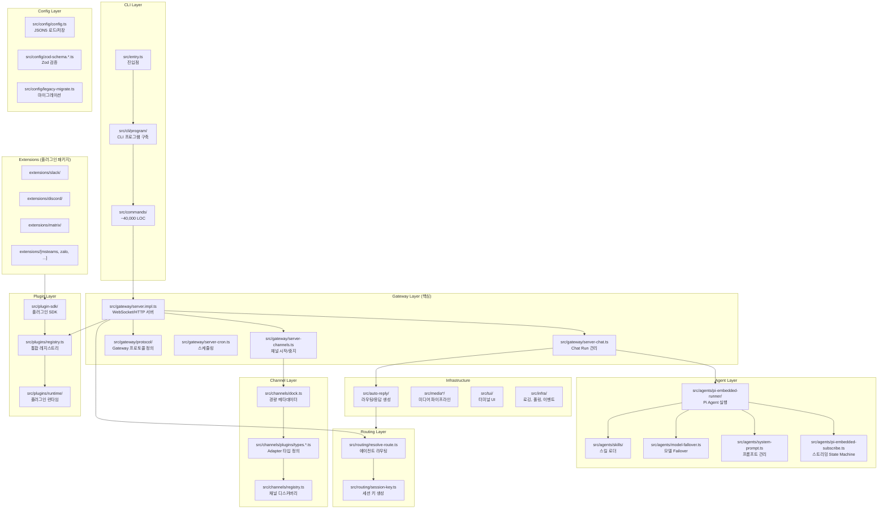
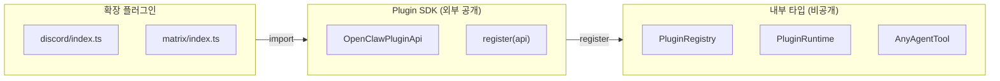
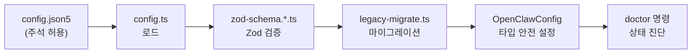

# OpenClaw — Architecture

## 모듈 구조



## 의존 관계 분석

### 계층 간 의존성

| From | To | 관계 |
|------|----|------|
| CLI → Gateway | 단방향 | CLI가 Gateway 시작/제어 |
| Gateway → Agent | 단방향 | 메시지 수신 시 Agent 실행 |
| Gateway → Channel | 단방향 | 채널 시작/중지/메시지 전송 |
| Gateway → Routing | 단방향 | 에이전트/세션 라우팅 결정 |
| Gateway → Plugin | 단방향 | 플러그인 로드/레지스트리 관리 |
| Agent → Plugin | 단방향 | Tool/Skill 실행 |
| Extension → Plugin SDK | 단방향 | SDK 인터페이스 의존 |
| Config ← 모든 레이어 | 공유 | 설정 읽기 |

**핵심 원칙**: 의존성이 항상 상위 → 하위로 흐르며, 순환 의존 없음.

### 외부 의존성 관리

**`pnpm-workspace.yaml`**에서의 명시적 네이티브 바인딩 관리:

```yaml
onlyBuiltDependencies:
  - "@lydell/node-pty"
  - "@matrix-org/matrix-sdk-crypto-nodejs"
  - sharp
  - ...
```

네이티브 바인딩이 필요한 모듈만 화이트리스트로 관리하여 빌드 시간과 보안을 통제한다. `pnpm patches`로 데이터 손상 방지 패치도 적용한다.

## 설계 패턴 분석

### 1. Channel Adapter 패턴 (핵심)

4가지 독립 Adapter 타입으로 채널의 모든 측면을 모듈화한다.

**`src/channels/plugins/types.adapters.ts`**:

```typescript
// 1. 설정 적용 Adapter
export type ChannelSetupAdapter = {
  applyAccountConfig: (params: {...}) => OpenClawConfig;
}

// 2. 설정 조회/관리 Adapter
export type ChannelConfigAdapter<ResolvedAccount> = {
  listAccountIds, resolveAccount, isEnabled, isConfigured, ...
}

// 3. 메시지 발송 Adapter
export type ChannelOutboundAdapter = {
  deliveryMode: "direct" | "gateway" | "hybrid";
  chunker?: (text: string, limit: number) => string[];
  sendPayload?, sendText?, sendMedia?, sendPoll?
}

// 4. 상태 진단 Adapter
export type ChannelStatusAdapter = {
  probeAccount?, auditAccount?, buildAccountSnapshot?, ...
}
```

**설계 철학**: 각 채널은 필요한 Adapter만 구현. 예를 들어 iMessage는 outbound만, Telegram은 4가지 모두 구현. 이를 통해:
- **공유 로직** (라우팅, 보안, 청킹)과 **채널별 로직** (인증, 프로토콜)을 깔끔하게 분리
- 새 채널 추가 시 필요한 Adapter만 구현하면 됨
- 타입 시스템이 누락된 구현을 컴파일 타임에 잡음

### 2. Plugin Registry + SDK 분리



**`src/plugin-sdk/index.ts`** (~150줄):

```typescript
export type OpenClawPluginApi = {
  runtime: PluginRuntime;
  registerChannel(...);
  registerCommand(...);
  registerTool(...);
  registerHook(...);
}
```

**트레이드오프**:
- **장점**: 플러그인 버전/의존성 독립, 선택적 로딩, SDK 안정성 보장
- **단점**: 런타임 검증 필수(`safeParse`, `validate`), SDK 버전 관리 오버헤드

### 3. Gateway 중심 제어평면

모든 클라이언트(macOS, iOS, Android, WebChat, CLI)가 단일 Gateway에 WebSocket으로 연결되는 구조다.

**`src/gateway/server.impl.ts`**:

```typescript
export type GatewayServer = {
  // WS 메서드 등록 (RPC 기반)
  // 이벤트 스트림 (노드, 채널, 에이전트 이벤트)
  // 원격 노드: node.list, node.describe, node.invoke
}
```

**원격 노드 capability 협상**: 모바일/데스크톱 노드가 Gateway에 연결하면 자신의 capability를 선언하고, Gateway가 적절한 기능을 라우팅한다.

**설계 이점**:
- 단일 진실 공급원: 모든 상태가 Gateway에 집중
- Loopback 기본 바인딩으로 보안 기본값 강화
- Tailscale 통합으로 VPN 기반 원격 접근

### 4. JSON5 + Zod 설정 관리



**`src/config/` 구성**:
- `config.ts`: 로드/저장 로직
- `types.ts`: OpenClawConfig 인터페이스 정의
- `zod-schema.*.ts`: 채널/에이전트별 검증 스키마
- `legacy-migrate.ts`: 설정 스키마 마이그레이션

**설계 의도**: JSON5로 사용자 친화적 설정(주석 가능)을 제공하면서, Zod 스키마로 런타임 안전성을 보장. `doctor` 명령으로 설정 문제를 사전에 진단.

### 5. Workspace-first 파일시스템 설계

```
~/.openclaw/
├── config.json5          # 전역 설정
├── agents/
│   └── <agentId>/
│       ├── AGENTS.md     # 에이전트 bootstrap
│       ├── SOUL.md       # 페르소나 정의
│       ├── TOOLS.md      # 도구 설명
│       ├── sessions/
│       │   └── *.jsonl   # 세션 기록
│       └── skills/
│           └── *.json    # 스킬 설정
└── plugins/              # 확장 플러그인
```

**설계 원칙**:
- 모든 상태가 파일시스템에 존재 → DB 불필요
- 디렉토리 구조가 곧 데이터 모델
- 백업 = 디렉토리 복사, 이동 = 디렉토리 이동

### 6. 코드 품질 관리 패턴

| 관행 | 구현 |
|------|------|
| 모듈 크기 제한 | ~500 LOC 가이드라인 (기능별 정리) |
| 타입 안전성 | TypeScript Strict + `experimentalDecorators` |
| 테스트 | vitest + V8 커버리지 70% threshold |
| 린팅 | oxlint (Rust 기반 고속) |
| 포맷 | oxfmt (Rust 기반 고속) |
| 주석 | "왜"에 집중 (구현 세부사항 아님) |

---

## 배울 점

1. **4-Adapter 채널 추상화**: Setup/Config/Outbound/Status로 채널의 모든 측면을 독립적으로 모듈화. 필요한 것만 구현하는 점진적 통합이 가능
2. **Plugin SDK와 내부 타입의 명확한 경계**: 외부 공개 SDK와 내부 구현 타입을 분리하여 플러그인의 독립적 진화를 보장. `peerDependencies`로 느슨한 결합
3. **Gateway 중심의 단일 제어평면**: 분산 시스템의 복잡성을 의도적으로 피하고, 단일 프로세스에서 모든 상태를 관리하여 단순성과 일관성 확보
4. **파일시스템 = 데이터 모델**: 디렉토리 구조가 곧 엔티티 관계. DB 추상화 없이 `ls`, `cat`으로 디버깅 가능한 운영 친화적 설계

## 적용 아이디어

| OpenClaw 아키텍처 | EDR AI 적용 |
|-------------------|-------------|
| 4-Adapter 패턴 | AI 데이터 소스(SIEM 로그, 엔드포인트 이벤트, 네트워크 트래픽)별 Adapter를 Setup/Config/Ingest/Status로 분리 |
| Plugin SDK 분리 | AI 기능(AI-01~08)을 플러그인 SDK 기반으로 개발하여 독립 배포/업데이트 가능하게 설계 |
| Gateway 제어평면 | AI 요청의 단일 진입점 Gateway를 두어 인증, 라우팅, 로깅, 레이트 리밋을 중앙 관리 |
| Zod 설정 검증 | AI 설정(모델 파라미터, 프롬프트 템플릿, 보안 정책)을 스키마 기반으로 검증하여 잘못된 설정 사전 차단 |
| Workspace 패턴 | AI 분석 세션/결과를 사용자별 workspace 디렉토리로 관리하여 격리와 감사 추적 용이하게 |
