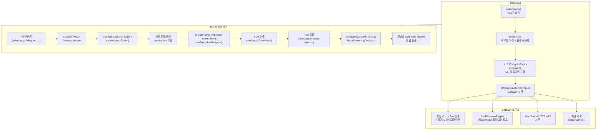
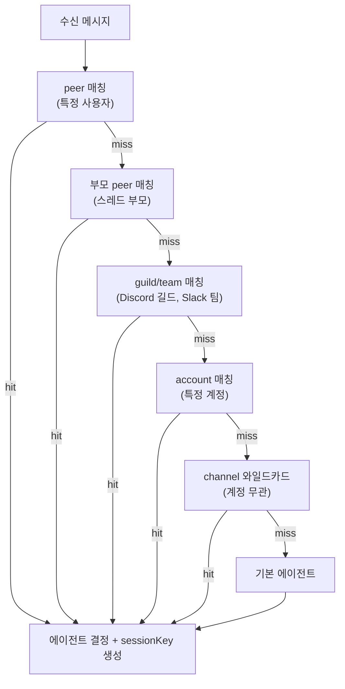

# OpenClaw — Core Logic

## 전체 실행 흐름



## 핵심 알고리즘/패턴 상세 분석

### 1. 계층적 바인딩 라우팅 (Multi-level Binding Resolution)

메시지가 도착하면 어떤 에이전트가 처리할지 결정하는 핵심 로직이다. 여러 수준의 매칭을 fallback 체인으로 구성한다.



**`src/routing/resolve-route.ts:171-264`** 핵심 코드:

```typescript
export function resolveAgentRoute(input: ResolveAgentRouteInput): ResolvedAgentRoute {
  // 1. 바인딩 필터링: channel + accountId 매칭
  const bindings = listBindings(input.cfg).filter((binding) => {
    if (!matchesChannel(binding.match, channel)) return false;
    return matchesAccountId(binding.match?.accountId, accountId);
  });

  // 2. 우선순위 기반 에이전트 선택
  // peer → parent → guild → team → account → channel → default

  // 3. sessionKey 생성
  const sessionKey = buildAgentSessionKey({
    agentId: resolvedAgentId,
    channel, accountId, peer,
    dmScope: cfg.session?.dmScope,
    identityLinks: cfg.session?.identityLinks,
  });
}
```

**설계 의도**: 설정 파일만으로 "이 사람에게는 코딩 에이전트, 이 그룹에는 일반 에이전트" 같은 복잡한 라우팅을 선언적으로 정의.

### 2. 세션 키 생성 (Session Key Building)

멀티채널 환경에서 대화 격리를 보장하는 키 생성 패턴이다.

**`src/routing/session-key.ts`**:

```typescript
// 키 포맷: agent:mainKey:channel:accountId:chatType:peerId[:identityLink]
buildAgentPeerSessionKey({
  agentId: "default",
  mainKey: "main",
  channel: "telegram",
  accountId: "default",
  peerKind: "direct",
  peerId: "+1234567890",
  dmScope: "per-peer",   // per-peer | main | per-channel-peer
  identityLinks: { "whatsapp": ["@user"] },
});
```

**핵심**: `dmScope` 설정으로 세션 공유 범위를 제어한다.
- `per-peer`: 채널+사용자별 독립 세션 (기본값)
- `main`: 모든 채널의 같은 사용자가 하나의 세션 공유
- `per-channel-peer`: 채널마다 분리하되 사용자별 유지

`identityLinks`는 동일 사용자의 크로스채널 세션을 연결하는 메커니즘이다.

### 3. 스트림 병합 (Block Streaming Coalesce)

LLM 스트리밍 응답을 효율적으로 배치 전송하는 핵심 메커니즘이다.

**`src/gateway/server-chat.ts:1-250`**:

```typescript
export type ChatRunState = {
  registry: ChatRunRegistry;       // sessionKey → [ChatRunEntry]
  buffers: Map<string, string>;    // runId → buffered text
  deltaSentAt: Map<string, number>; // runId → last send timestamp
  abortedRuns: Map<string, number>; // runId → abort timestamp
};

// 메커니즘:
// 1. 토큰 스트리밍 → 버퍼에 누적
// 2. minChars 또는 idleMs 조건 충족 시 배치 전송
// 3. 채널별 청크 제한 적용 (Telegram 4000자 등)
// 4. 최종 응답 병합 후 한 번에 전송
```

**`src/agents/pi-embedded-subscribe.ts`** 의 상태 머신:

```typescript
const state: EmbeddedPiSubscribeState = {
  assistantTexts: [],
  blockBuffer: "",
  blockState: { thinking: false, final: false, inlineCode: ... },
  deltaBuffer: "",                    // 청크 누적
  lastAssistantTextNormalized: "",    // 중복 감지용
  // ... 50개 이상의 상태 변수
};
```

**설계 포인트**:
- Thinking 블록 감지: `/<\s*(\/?)\s*think` 패턴으로 Claude의 reasoning 블록을 실시간 추적
- 마크다운 코드 스팬 인식: 코드 블록 중간에서 메시지를 자르지 않음
- 중복 메시지 정규화: `normalizeTextForComparison`으로 "Hello!" ≡ "hello!" 처리

### 4. Pi Agent 임베딩 (Embedded Pi Agent Runner)

LLM 호출과 tool 실행을 통합하는 에이전트 런타임이다.

**`src/agents/pi-embedded-runner/run.ts:137-200`**:

```typescript
export async function runEmbeddedPiAgent(
  params: RunEmbeddedPiAgentParams,
): Promise<EmbeddedPiRunResult> {
  // 1. Lane 해석 (동시성 제어)
  const sessionLane = resolveSessionLane(params.sessionKey);
  const globalLane = resolveGlobalLane(params.lane);

  // 2. 모델 & 인증 선택
  const apiKey = await getApiKeyForModel(selectedModel, authProfiles);

  // 3. Context window 계산 및 가드
  evaluateContextWindowGuard(contextWindow, sessionHistory);

  // 4. Tool 주입 (채널 도구 + 스킬 도구 + 내장 도구)
  const allCustomTools = [...channelTools, ...skillTools, ...openclawTools];

  // 5. Pi SDK 세션 실행
  const result = await runEmbeddedAttempt({
    session: activeSession,
    userMessage: params.prompt,
    tools: allCustomTools,
    onBlock: (block) => params.onBlockReply(block),
  });
}
```

**동시성 제어**: Lane 패턴으로 세션별 직렬화와 글로벌 리소스 제한을 동시에 구현한다.
- Session lane: 같은 세션의 메시지는 순서대로 처리 (race condition 방지)
- Global lane: 전체 동시 에이전트 실행 수 제한

### 5. 플러그인 레지스트리 (Plugin Registry Pattern)

모든 확장 기능을 단일 레지스트리에서 관리하는 패턴이다.

**`src/plugins/registry.ts:146-157`**:

```typescript
export type PluginRegistry = {
  plugins: PluginRecord[];
  tools: PluginToolRegistration[];
  hooks: PluginHookRegistration[];
  channels: PluginChannelRegistration[];
  providers: ProviderPluginRegistration[];
  gatewayHandlers: GatewayRequestHandlers;
  httpRoutes: PluginHttpRouteRegistration[];
  services: PluginServiceRegistration[];
  commands: PluginCommandRegistration[];
};
```

플러그인 SDK(`src/plugin-sdk/index.ts`)를 통한 동적 등록:

```typescript
export type OpenClawPluginApi = {
  runtime: PluginRuntime;
  registerChannel(...);   // 새 채널 등록
  registerCommand(...);   // CLI 명령 등록
  registerTool(...);      // 에이전트 도구 등록
  registerHook(...);      // 이벤트 훅 등록
}

// 플러그인은 register(api) 함수 하나만 export
// Discord, Slack 확장도 동일 방식
```

**설계 의도**: 코어와 플러그인의 타입 경계를 명확히 분리하여 SDK 버전 관리와 독립적 배포를 가능하게 함.

### 6. 채널 Dock 패턴

채널별 경량 메타데이터 선언으로 공유 로직과 채널별 로직을 분리한다.

**`src/channels/dock.ts:44-68`**:

```typescript
const DOCKS: Record<ChatChannelId, ChannelDock> = {
  telegram: {
    id: "telegram",
    capabilities: { chatTypes: ["direct", "group", "channel", "thread"] },
    outbound: { textChunkLimit: 4000 },
    groups: { resolveRequireMention: true },
    mentions: { ... },
  },
  whatsapp: {
    id: "whatsapp",
    capabilities: { chatTypes: ["direct", "group"] },
    outbound: { textChunkLimit: 65536 },
    // ...
  },
};
```

**핵심 원칙**: "keep this module light" — Dock은 무거운 인증/프로빙 로직 없이 순수 메타데이터만 담고, 실제 프로토콜 처리는 플러그인에 위임.

---

## 배울 점

1. **계층적 Fallback 라우팅**: 복잡한 라우팅 요구사항을 코드 수정 없이 설정만으로 해결하는 패턴. peer → guild → account → channel → default의 자연스러운 우선순위 체계
2. **Lane 기반 동시성 제어**: 세션 단위 직렬화와 글로벌 자원 제한을 두 레벨 Lane으로 분리하여 race condition과 리소스 고갈을 동시에 방지
3. **스트리밍 State Machine의 정교함**: 단순한 토큰 중계가 아닌, thinking 블록 추적/마크다운 인식/중복 감지를 결합한 상태 머신으로 안정적 스트리밍
4. **Plugin Registry의 다형성**: 하나의 레지스트리가 채널, 도구, 훅, provider, 명령 등 다양한 타입의 플러그인을 통합 관리

## 적용 아이디어

| OpenClaw 패턴 | EDR AI 적용 |
|---------------|-------------|
| 계층적 바인딩 라우팅 | AI 요청을 사용자 역할(관리자/분석가/운영자) → 기능(AI-01~08) → 기본 모델 순으로 라우팅 |
| Lane 기반 동시성 | 사용자별 AI 요청 직렬화 + 전체 LLM 동시 호출 수 제한으로 안정성 확보 |
| 스트리밍 State Machine | AI 분석 결과를 실시간 스트리밍할 때 thinking/결과 블록 분리하여 UX 개선 |
| Plugin Registry | AI 기능(AI-01~08)을 플러그인 형태로 등록/관리하여 독립적 개발/배포 가능 |
| Session Key 패턴 | 사용자+기능+컨텍스트 조합으로 AI 대화 세션을 격리하여 데이터 보안 강화 |
